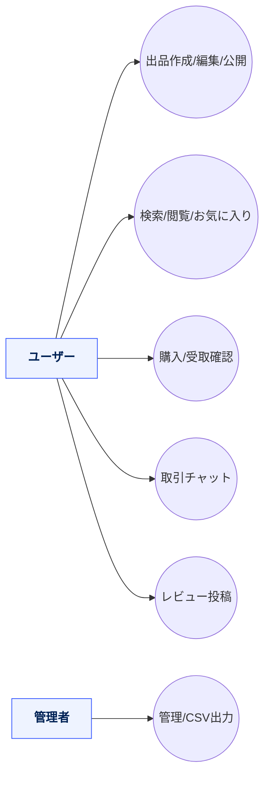
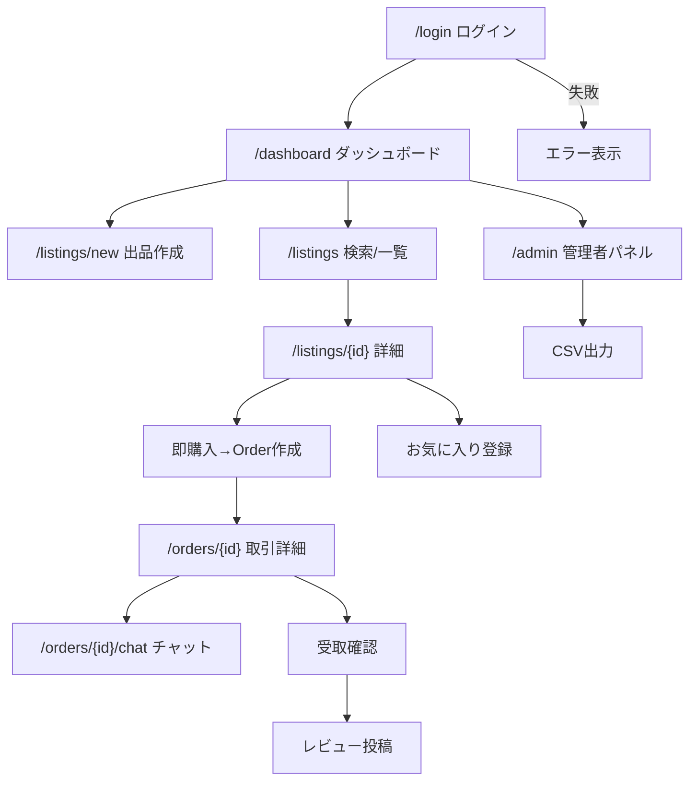
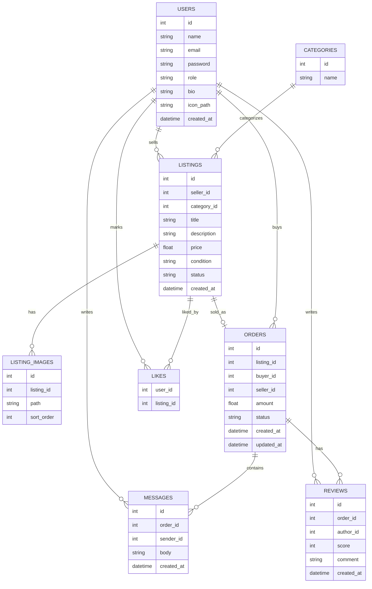
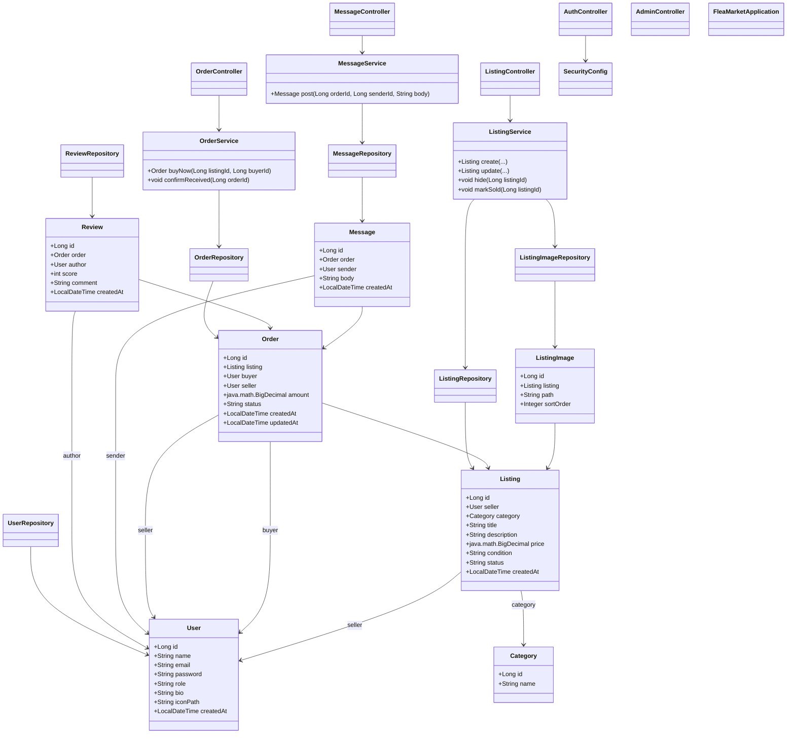

# Flea Market Matching App（後期版）— フリマ系マッチング・ミニシステム

**出品（Listing）／購入（Order）／チャット（Message）／レビュー／お気に入り**を備えた学習用 Web アプリです。  
後期課題向けに **Spring Boot 3 + Spring Security + Spring Data JPA + Thymeleaf**、DB は **PostgreSQL** を想定したテンプレートです。

> **注**: 本 README はテンプレートです。実プロジェクトのクラス名・パスが異なる場合は読み替えてください。  
> Mermaid は **`mermaid`（小文字）** を指定し、**行内コメント（`--`）は使わない**でください（コメントは `%%` を行頭に）。

---

## 目次
- [機能](#機能)
- [アーキテクチャ](#アーキテクチャ)
- [ディレクトリ構成](#ディレクトリ構成)
- [セットアップと起動](#セットアップと起動)
- [サンプルアカウント](#サンプルアカウント)
- [ユーザーストーリー](#ユーザーストーリー)
- [ユースケース図（Mermaid）](#ユースケース図mermaid)
- [画面遷移図（Mermaid）](#画面遷移図mermaid)
- [ER 図（Mermaid）](#er-図mermaid)
- [クラス図（Mermaid）](#クラス図mermaid)
- [クラス設計表（責務・主要メソッド）](#クラス設計表責務主要メソッド)
- [用語辞書](#用語辞書)
- [ライセンス](#ライセンス)

---

## 機能

**共通（ユーザー）**
- サインアップ／ログイン、プロフィール編集（自己紹介・アイコン）
- 出品の検索・フィルタ（カテゴリ／価格帯／キーワード／状態）
- お気に入り（Like）登録／解除

**出品者（Seller）**
- 出品作成・編集・公開/非公開・在庫管理（1点物想定）
- 画像アップロード（複数枚）
- コメント／取引チャット対応

**購入者（Buyer）**
- カートを介さない**即購入**（数量1想定）
- 出品者との**取引チャット**
- 受取確認→レビュー投稿

**管理者（Admin）**
- ユーザー／出品／注文／レビューの一覧・状態更新
- 通報（Report）一次対応（任意）
- CSV 出力（期間別件数・粗い売上集計）

---

## アーキテクチャ

- **言語/ランタイム**: Java 17+
- **Web**: Spring Boot 3 / Spring MVC / Spring Security
- **View**: Thymeleaf（`templates/*.html`）
- **永続化**: Spring Data JPA（`*Repository`）
- **DB**: PostgreSQL（`schema.sql` / `data.sql`）
- **ビルド**: Maven
- **構成**: Entity / Repository / Service / Controller / Config / View

---

## ディレクトリ構成

```text
flea-market-matching-app-kouki/
├─ pom.xml
├─ src/
│  └─ main/
│     ├─ java/com/example/fleamarket/
│     │  ├─ FleaMarketApplication.java
│     │  ├─ config/
│     │  │  └─ SecurityConfig.java
│     │  ├─ controller/
│     │  │  ├─ AuthController.java
│     │  │  ├─ ListingController.java
│     │  │  ├─ OrderController.java
│     │  │  ├─ MessageController.java
│     │  │  └─ AdminController.java
│     │  ├─ entity/
│     │  │  ├─ User.java
│     │  │  ├─ Listing.java
│     │  │  ├─ ListingImage.java
│     │  │  ├─ Order.java
│     │  │  ├─ Message.java
│     │  │  ├─ Review.java
│     │  │  └─ Category.java
│     │  ├─ repository/
│     │  │  ├─ UserRepository.java
│     │  │  ├─ ListingRepository.java
│     │  │  ├─ ListingImageRepository.java
│     │  │  ├─ OrderRepository.java
│     │  │  ├─ MessageRepository.java
│     │  │  └─ ReviewRepository.java
│     │  └─ service/
│     │     ├─ ListingService.java
│     │     ├─ OrderService.java
│     │     └─ MessageService.java
│     └─ resources/
│        ├─ application.properties
│        ├─ schema.sql
│        ├─ data.sql
│        ├─ static/css/style.css
│        └─ templates/
│           ├─ login.html
│           ├─ dashboard.html
│           ├─ listing_form.html
│           ├─ listing_detail.html
│           ├─ listing_search.html
│           ├─ order_detail.html
│           ├─ chat_room.html
│           └─ review_form.html
```

## セットアップと起動
1) 事前準備
 - Java 17+
 - Maven 3.9+
 - PostgreSQL 15+
2) DB 接続設定（環境に合わせて修正）
 - src/main/resources/application.properties:
```text
spring.datasource.url=jdbc:postgresql://localhost:5432/fleamarket_db
spring.datasource.username=fleamarket_app
spring.datasource.password=password

spring.jpa.hibernate.ddl-auto=none
spring.sql.init.mode=always
spring.sql.init.schema-locations=classpath:/schema.sql
spring.sql.init.data-locations=classpath:/data.sql

server.port=8080
```

3) スキーマ初期化
 - schema.sql:
```text
-- ========== CLEAN DROP (依存順) ==========
DROP TABLE IF EXISTS chat CASCADE;
DROP TABLE IF EXISTS favorite_item CASCADE;
DROP TABLE IF EXISTS review CASCADE;
DROP TABLE IF EXISTS app_order CASCADE;
DROP TABLE IF EXISTS item CASCADE;
DROP TABLE IF EXISTS category CASCADE;
DROP TABLE IF EXISTS user_complaint CASCADE;
DROP TABLE IF EXISTS users CASCADE;

-- ========== CREATE ==========
CREATE TABLE users (
  id SERIAL PRIMARY KEY,
  name VARCHAR(50) NOT NULL,
  email VARCHAR(255) NOT NULL UNIQUE,
  password VARCHAR(255) NOT NULL,
  role VARCHAR(20) NOT NULL,            -- 'USER' / 'ADMIN'
  line_notify_token VARCHAR(255),
  enabled BOOLEAN NOT NULL DEFAULT TRUE,

  -- ★ BAN系（最初から持たせる）
  banned BOOLEAN NOT NULL DEFAULT FALSE,
  ban_reason TEXT,
  banned_at TIMESTAMP,
  banned_by_admin_id INT
);

CREATE TABLE category (
  id SERIAL PRIMARY KEY,
  name VARCHAR(50) NOT NULL UNIQUE
);

CREATE TABLE item (
  id SERIAL PRIMARY KEY,
  user_id INT NOT NULL,
  name VARCHAR(255) NOT NULL,
  description TEXT,
  price NUMERIC(10,2) NOT NULL,
  category_id INT,
  status VARCHAR(20) DEFAULT '出品中',
  image_url TEXT,
  created_at TIMESTAMP DEFAULT CURRENT_TIMESTAMP,
  FOREIGN KEY (user_id) REFERENCES users(id),
  FOREIGN KEY (category_id) REFERENCES category(id)
);

CREATE TABLE app_order (
  id SERIAL PRIMARY KEY,
  item_id INT NOT NULL,
  buyer_id INT NOT NULL,
  price NUMERIC(10,2) NOT NULL,
  status VARCHAR(20) DEFAULT '購入済',
  payment_intent_id VARCHAR(128),               -- ★ StripeのPI ID
  created_at TIMESTAMP DEFAULT CURRENT_TIMESTAMP,
  FOREIGN KEY (item_id) REFERENCES item(id),
  FOREIGN KEY (buyer_id) REFERENCES users(id)
);

CREATE TABLE chat (
  id SERIAL PRIMARY KEY,
  item_id INT NOT NULL,
  sender_id INT NOT NULL,
  message TEXT,
  created_at TIMESTAMP DEFAULT CURRENT_TIMESTAMP,
  FOREIGN KEY (item_id) REFERENCES item(id),
  FOREIGN KEY (sender_id) REFERENCES users(id)
);

CREATE TABLE favorite_item (
  id SERIAL PRIMARY KEY,
  user_id INT NOT NULL,
  item_id INT NOT NULL,
  created_at TIMESTAMP DEFAULT CURRENT_TIMESTAMP,
  UNIQUE (user_id, item_id),
  FOREIGN KEY (user_id) REFERENCES users(id),
  FOREIGN KEY (item_id) REFERENCES item(id)
);

CREATE TABLE review (
  id SERIAL PRIMARY KEY,
  order_id INT NOT NULL UNIQUE,
  reviewer_id INT NOT NULL,
  seller_id INT NOT NULL,
  item_id INT NOT NULL,
  rating INT NOT NULL CHECK (rating BETWEEN 1 AND 5),
  comment TEXT,
  created_at TIMESTAMP DEFAULT CURRENT_TIMESTAMP,
  FOREIGN KEY (order_id) REFERENCES app_order(id),
  FOREIGN KEY (reviewer_id) REFERENCES users(id),
  FOREIGN KEY (seller_id) REFERENCES users(id),
  FOREIGN KEY (item_id) REFERENCES item(id)
);

CREATE TABLE user_complaint (
  id SERIAL PRIMARY KEY,
  reported_user_id INT NOT NULL,
  reporter_user_id INT NOT NULL,
  reason TEXT NOT NULL,
  created_at TIMESTAMP NOT NULL DEFAULT CURRENT_TIMESTAMP,
  FOREIGN KEY (reported_user_id) REFERENCES users(id),
  FOREIGN KEY (reporter_user_id) REFERENCES users(id)
);

-- ========== INDEX ==========
CREATE INDEX IF NOT EXISTS idx_users_banned           ON users(banned);
CREATE INDEX IF NOT EXISTS idx_users_banned_by        ON users(banned_by_admin_id);

CREATE INDEX IF NOT EXISTS idx_item_user_id           ON item(user_id);
CREATE INDEX IF NOT EXISTS idx_item_category_id       ON item(category_id);

CREATE INDEX IF NOT EXISTS idx_order_item_id          ON app_order(item_id);
CREATE INDEX IF NOT EXISTS idx_order_buyer_id         ON app_order(buyer_id);
CREATE UNIQUE INDEX IF NOT EXISTS ux_order_pi         ON app_order(payment_intent_id);

CREATE INDEX IF NOT EXISTS idx_chat_item_id           ON chat(item_id);
CREATE INDEX IF NOT EXISTS idx_chat_sender_id         ON chat(sender_id);

CREATE INDEX IF NOT EXISTS idx_fav_user_id            ON favorite_item(user_id);
CREATE INDEX IF NOT EXISTS idx_fav_item_id            ON favorite_item(item_id);

CREATE INDEX IF NOT EXISTS idx_review_order_id        ON review(order_id);

CREATE INDEX IF NOT EXISTS idx_uc_reported            ON user_complaint(reported_user_id);
CREATE INDEX IF NOT EXISTS idx_uc_reporter            ON user_complaint(reporter_user_id);
```

4) 起動
```text
mvn spring-boot:run
# → http://localhost:8080/
```

## サンプルアカウント
| 役割    | メール                                           | パスワード     |
| ----- | --------------------------------------------- | --------- |
| USER  | [user1@example.com](mailto:user1@example.com) | password  |
| USER  | [user2@example.com](mailto:user2@example.com) | password  |
| ADMIN | [admin@example.com](mailto:admin@example.com) | adminpass |

 - 開発用の平文または簡易エンコードを想定。本番は BCrypt 等に切り替えてください。

## ユーザーストーリー
 - ユーザーとして、簡単に出品して画像を登録し、検索で見つけてもらい、チャットで取引したい。
 - 購入者として、即購入して受取確認→レビューまでスムーズに完結したい。
 - 管理者として、不適切コンテンツを抑止し、全体の流通状況を可視化したい。

## ユースケース図


## 画面遷移図


## ER 図


## クラス図


## クラス設計表（責務・主要メソッド）
| クラス                 | 役割（責務）         | 主要メソッド                                 | 共同作業相手                                        |
| ------------------- | -------------- | -------------------------------------- | --------------------------------------------- |
| `User`              | ユーザー（購入/出品/管理） | getter/setter                          | `UserRepository`                              |
| `Category`          | 出品カテゴリ         | getter/setter                          | `ListingRepository`                           |
| `Listing`           | 出品             | getter/setter                          | `ListingRepository`, `User`, `Category`       |
| `ListingImage`      | 出品画像           | getter/setter                          | `ListingImageRepository`, `Listing`           |
| `Order`             | 注文（取引）         | getter/setter                          | `OrderRepository`, `Listing`, `User`          |
| `Message`           | 取引チャット         | getter/setter                          | `MessageRepository`, `Order`, `User`          |
| `Review`            | 取引レビュー         | getter/setter                          | `ReviewRepository`, `Order`, `User`           |
| `ListingService`    | 出品作成/編集/状態変更   | `create`, `update`, `hide`, `markSold` | `ListingRepository`, `ListingImageRepository` |
| `OrderService`      | 即購入/受取確認       | `buyNow`, `confirmReceived`            | `OrderRepository`                             |
| `MessageService`    | チャット投稿         | `post`                                 | `MessageRepository`                           |
| `ListingController` | 出品画面/API       | `GET/POST /listings*`                  | `ListingService`                              |
| `OrderController`   | 注文画面/API       | `GET/POST /orders*`                    | `OrderService`                                |
| `MessageController` | チャット画面/API     | `GET/POST /orders/{id}/chat`           | `MessageService`                              |
| `AuthController`    | 認証画面           | `/login`                               | `SecurityConfig`                              |
| `AdminController`   | 管理機能（一覧/CSV）   | 画面ハンドラ                                 | 各 Repository                                  |
| `SecurityConfig`    | 認証/認可          | `SecurityFilterChain`                  | すべて                                           |


## 用語辞書
| 用語              | 意味                                               |
| --------------- | ------------------------------------------------ |
| 出品（Listing）     | ユーザーが販売する商品情報。価格・状態・画像・カテゴリを持つ                   |
| 注文（Order）       | 即購入で作成される取引。`IN_PROGRESS/SHIPPED/DONE/CANCELLED` |
| 取引チャット（Message） | 注文単位のメッセージスレッド                                   |
| レビュー（Review）    | 受取確認後の評価（スコア/コメント）                               |
| お気に入り（Like）     | ユーザーが気になる出品を保存                                   |
| 役割（role）        | `USER` / `ADMIN`                                 |


## ライセンス
 - 教育目的のサンプル。必要に応じてプロジェクト方針に合わせて追記してください。
```text

**補足**  
- Mermaid の `classDiagram` でインターフェイス表記（`<<interface>>`）は使わず、**通常クラスとして宣言**しています（GitHub のパーサ安定性のため）。  
- ジェネリクス表記はレンダリング相性が出るため、**必要に応じて説明文側に記載**してください。
::contentReference[oaicite:0]{index=0}
```

### ログイン画面


### 商品一覧画面


### チャット機能


### 決済機能


### 運営者ユーザー管理


### 運営者ユーザーban機能

